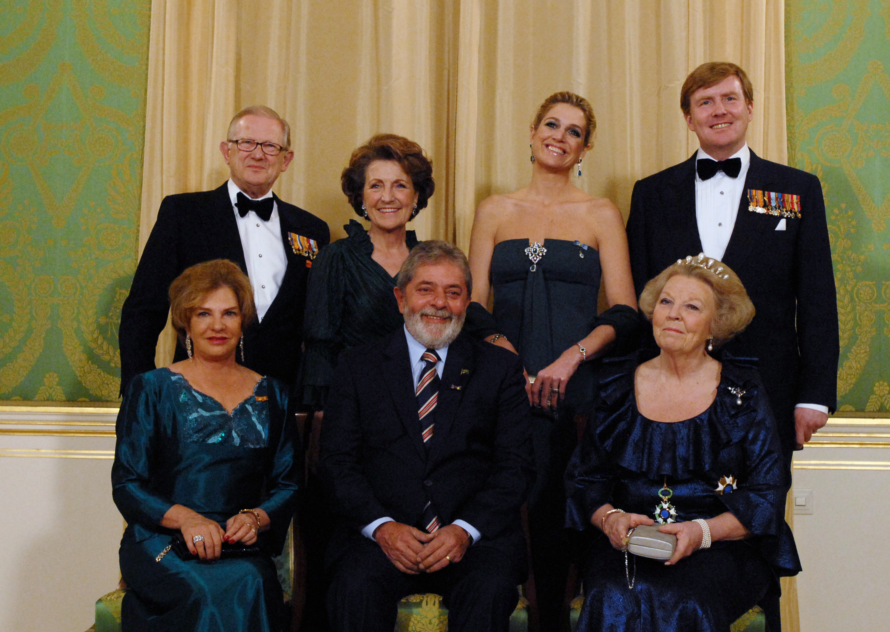
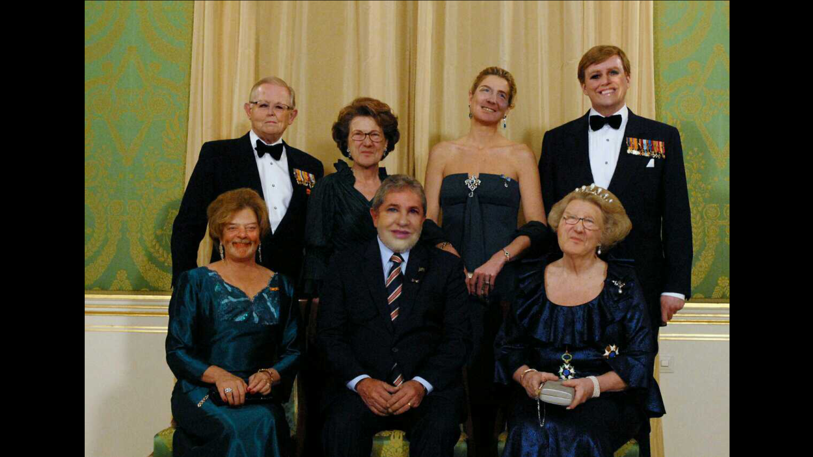

# FaceSwap
Android app for face swapping. 

A combination of the projects found here:

http://www.learnopencv.com/face-swap-using-opencv-c-python/

and here:

https://github.com/tzutalin/dlib-android-app

The app icon 

has two emojis from:
http://emojione.com/

### App features
* Swap faces of two selfies. Pick two photos and swap! (Use two first tabs)
* Swap faces of people in the same photo. (Use third tab)

### App interface

### Swap examples
Swap example of some (public domain) photos.

Swap example of a (public domain) photo of the Dutch royal family. Rather nice swap, it is hard to public domain photos of families.

